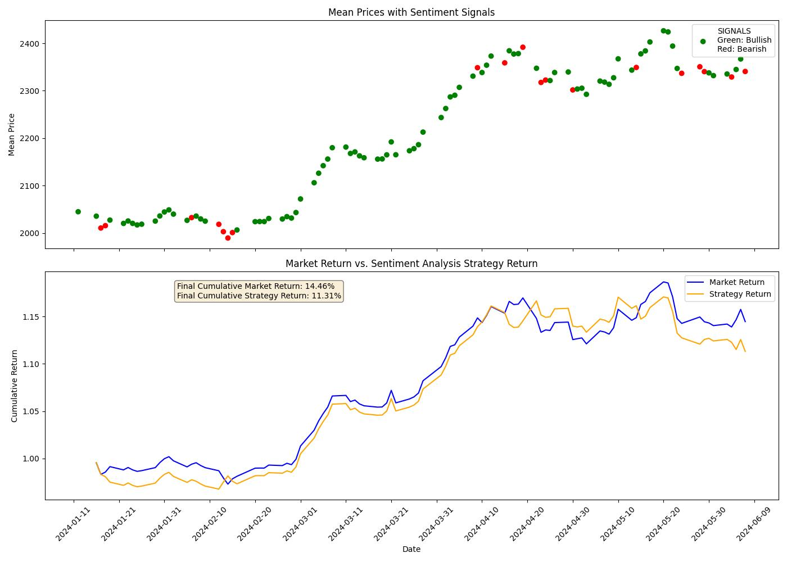

# Asset News Sentiment Analyzer

This application provides two sophisticated tools catering to sentiment analysis of financial assets and securities through Google search results and online news articles. You will just need an OpenAI API Key to get started and utilize the power of all the functionalities provided by this package, namely to fetch news articles, analyze their content, and produce insightful reports for investment and trading decisions.

A simple trading strategy involving daily sentiment analysis signals from this package may provide basic market traction of the target asset (We did a sample backtest on commodities over the past 100 market days):

<table>
  <tr>
    <td align="center">
      <strong>Crude Oil 100 Days</strong><br>
      
    </td>
    <td align="center">
      <strong>Gold 100 Days</strong><br>
      
    </td>
  </tr>
</table>

***Disclaimer: All investments and trading involve risk. This package is intended for research/academic purposes, and coding projects. It aids algorithmic/quantitative traders and researchers in their work. The reports and signals generated by this package does not constitute financial advice, and users should perform their own due diligence before making any trading decisions.***

## Contents

- [Two Main Classes](#two-main-classes)
  - [SentimentAnalyzer Tool](#1-sentimentanalyzer-tool)
  - [WebInteractor Tool](#2-webinteractor-tool)
- [Installation](#installation)
- [Contributing](#contributing)
- [License](#license)

## Two Main Classes

### 1. SentimentAnalyzer Tool

The `SentimentAnalyzer` class allows users to perform sentiment analysis on news articles related to a specific financial asset for any given date. It fetches news links, retrieves the content, and if desired, uses GPT models to generate reports and assess market sentiment.

**Usage**

```python
from asset_sentiment_analyzer import SentimentAnalyzer

# Initialize the analyzer
analyzer = SentimentAnalyzer(asset='Crude Oil', openai_key='your-openai-key')

# Get sentiment analysis as string for today or any date in the past (returns "bullish", "bearish", or "neutral")
sentiment = analyzer.get_sentiment(date='06-02-2024')
print(f"The sentiment for the asset is: {sentiment}")

# Fetch news links for any date with news_date argument in MM-dd-YYYY format.
news_links = analyzer.fetch_news_links(news_date='06-02-2024')

# Display news content
for url in news_links:
    print(analyzer.show_news_content(url))

# Generate a report
report = analyzer.produce_daily_report(date='06-02-2024', max_words=300)
print(report)

```

**API Reference**

* `SentimentAnalyzer(<asset_name>)`: Initializes the SentimentAnalyzer object with specified asset and optional OpenAI key (`openai_key` parameter) and model selection (`model` parameter).

__Available Methods:__

* `.fetch_news_links()`: Fetches news links from Google Search News tab for the specified asset on the given date. If `news_date` parameter is not assigned, it will retrieve the current day's latests news links. `nlinks` parameter denotes the number of news links to retrieve, default is `4`.
* `.show_news_content(<news_url>)`: Parses and returns main content as string for a given news URL.
* `.get_sentiment()`: Analyzes online results automatically and returns the news sentiment for asset/security on any given date. If `date` parameter is not assigned, it will return the current day's latest sentiment verdict.
* `.produce_daily_report()`: Generates a daily report returned as string with insights based on the online Google Search content for any given date. If `date` parameter is not assigned, it will generate report for the current day. The default `max_words` is `100`, but this can be adjusted as preferred.

Note: All dates must be in `MM-dd-YYYY` format or must be passed as a `datetime.datetime` object into the methods.

### 2. WebInteractor Tool

The `WebInteractor` class provides functionalities to interact with web content, perform Google searches, and retrieve content, which can then be fed into a GPT client for further interaction.

**Usage**

```python
from asset_sentiment_analyzer import WebInteractor

# Initialize the WebInteractor
web_interactor = WebInteractor()

# Perform a Google search and retrieve result links as list
search_results = web_interactor.search_google(query="Apple Stocks", nlinks=5)
print(search_results)

# Fetch the main content of a webpage
content = web_interactor.get_webpage_main_content(url="https://example.com")
print(content)

# Interact with a GPT model
my_prompt = f"""
How will this affect the latest Apple earnings report:
{content}
"""
response = web_interactor.get_llm_response(prompt=my_prompt, openai_api_key="your_openai_api_key")
print(response)

```

**API Reference**

* `WebInteractor()`: Initializes a WebInteractor object which provides functionalities for interacting with web content and performing web searches.

__Available Methods:__

* `.search_google(<query>)`: Searches Google for the specified query and retrieves a list of unique links. Parameters:
  * `query` (str): The search query.
  * `tld` (str, optional): The top-level domain for Google (eg. 'com' for Google.com).
  * `lang` (str, optional): The language setting for the Google search.
  * `date` (str, optional): The date to refine search results. (`MM-dd-YYYY` format)
  * `country` (str, optional): The country setting for Google search results.
  * `tab` (str, optional): Specifies the tab under which the search is performed, allowing for specific types of search results.
  * Possible values include:
    - `'app'` for Applications
    - `'blg'` for Blogs
    - `'bks'` for Books
    - `'dsc'` for Discussions
    - `'isch'` for Images
    - `'nws'` for News
    - `'pts'` for Patents
    - `'plcs'` for Places
    - `'rcp'` for Recipes
    - `'shop'` for Shopping
    - `'vid'` for Video
  * `nlinks` (int, optional): The number of links to retrieve.
* `.get_webpage_main_content(<url>)`: Fetches the main content of a webpage.
* `.get_llm_response(<prompt>, <openai_api_key>)`: A method to interact with a GPT language model based on a specified prompt and retrieve its response.

## Installation

Project has been published on pip

```bash
pip install asset-sentiment-analyzer
```

## Contributing

If you would like to contribute to this project, please follow the guidelines below:

- Fork the repository.
- Create a new branch (git checkout -b feature-branch).
- Make your changes.
- Commit your changes (git commit -m 'Add new feature').
- Push to the branch (git push origin feature-branch).
- Open a pull request.

## License

This project is pioneered by SkyBlue Capital (Singapore), and is licensed under the Apache-2.0 License. See the LICENSE file for details.


